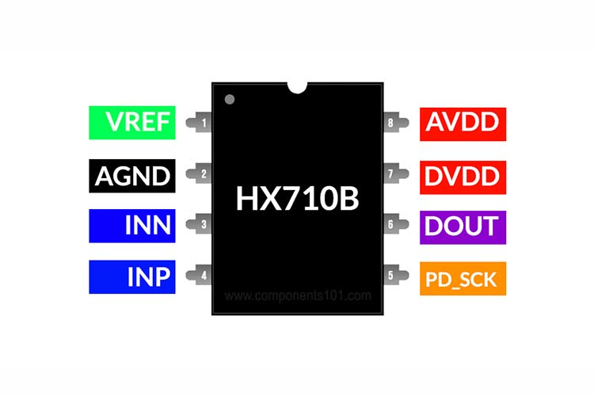
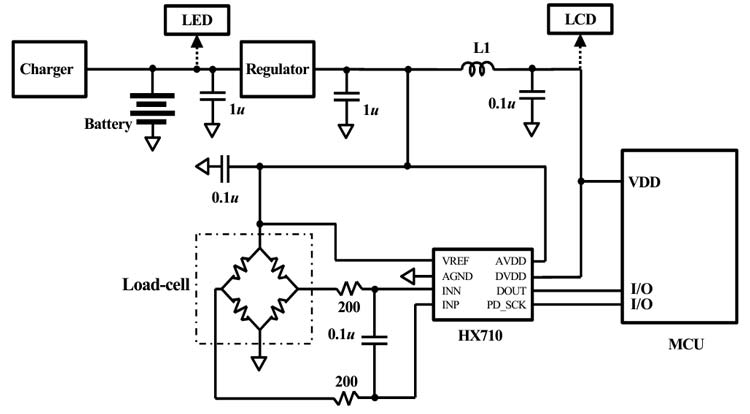

HX710 24-Bit ADC with Built-in Temperature Sensor
=================================================

.. seo::
    :description: Instructions for setting up HX710 within ESPHome
    :image: HX710B-IC.jpg
    :keywords: HX710

The ``hx710`` sensor platform allows you to use your HX710
24-Bit ADC within ESPHome
**NOTE:** **HX710A** has Temperature sensor. **HX710B** reads DVDD-AVDD and **HX710C** does not have anything for Other mode.
SOURCES: (`datasheet <https://components101.com/sites/default/files/component_datasheet/hx710b_datasheet.pdf>`__, `Components101`_, `LCSC HX710A <https://www.lcsc.com/product-detail/Analog-to-Digital-Converters-ADC_Avia-Semicon-Xiamen-HX710A_C68417.html>`__) 

    HX710 24-Bit ADC. Image by `Components101`_.

.. _Components101: https://components101.com/ics/hx710b-24-bit-adc-forweighing-scale-applications

Connect ``GND`` to ``GND``, ``VCC`` and ``VREF`` to ``3.3V`` and the other two ``DOUT`` (or ``DT`` for short)
and ``CLK`` (or ``SCK``) to free GPIO pins.

    HX710 24-Bit ADC Typical Schematic. Image by `Components101`_.

.. _Components101: https://components101.com/ics/hx710b-24-bit-adc-forweighing-scale-applications

.. code-block:: yaml

    # Example configuration entry
    sensor:
      - platform: hx710
        name: "HX710 Value"
        dout_pin: D0
        clk_pin: D1
        reference_voltage: 3.3V
        mode: 1
        update_interval: 60s

Configuration variables:
------------------------

- **dout_pin** (**Required**, :ref:`Pin Schema <config-pin_schema>`): The DOUT (or DAT) pin.
- **clk_pin** (**Required**, :ref:`Pin Schema <config-pin_schema>`): The CLK pin.
- **reference_voltage** (*Optional*, Voltage): This specifies the referance voltage supplied to ADC. Also, this is how it calculates the voltage on sample function. **Note:** Passing in a 0.0V will cause it to just dump the data with voltage_sampler::VoltageSampler.sample()
- **mode** (*Optional*, enum): The gain. Implicitly selects the frequency and register. Defaults to ``1``.

    - ``1`` (10 HZ, Differential Input)
    - ``2`` (40 HZ, Other - Temp on HX710A and DVDD-AVDD on HX710B)
    - ``3`` (40 HZ, Differential Input)

- **update_interval** (*Optional*, :ref:`config-time`): The interval to check the sensor. Defaults to ``60s``.

- All other options from :ref:`Sensor <config-sensor>`.

Converting Units
----------------

As the HX710 does not have any calibration data, you have to convert the measurement to units yourself.
To calibrate the sensor:

1. Place a zero load or a known mass on the sensor, for example ``0kg``
2. Wait for the data to arrive in the logs and write down the value. For example ``120``.
3. Place another (different) known mass on the sensor, for example ``1kg``
4. Again wait for the data to arrive and note the value, for example ``810``.

Once you've done those steps, you can use the ``calibrate_linear`` filter to map the incoming value
to the calibrated one:

.. code-block:: yaml

    # Example configuration entry
    sensor:
      - platform: hx710
        # ... Other HX710 options
        filters:
          - calibrate_linear:
              - 120 -> 0
              - 810 -> 1
        unit_of_measurement: kg

Replace the masses and values ``120.0``, ``810.0``, etc with your values.

Pressure Sensor Example
-----------------------
Since, this is a differential ADC it reads based on the differential between positive and negative inputs as the value. 
This works great in the case you want to read between both positive pressure and vacuum conditions with a differential pressure sensor containing a resistor bridge array.
Such as `GZP168 <https://www.lcsc.com/product-detail/Pressure-Sensors_Sencoch-Semiconductor-GZP168-001S_C3037986.html>`__
Simply read the ``0`` pressure point and get the voltage provided there. Say it was ``-0.2831 V`` then read another know pressure and get its value at that point 
say it was ``2.3461 V`` now use ``calibrate_linear`` with those two points in it. Also say the ``reference_voltage`` was ``5.0V`` it will be possible to calculate the pressures accross the supported 
range quite well from testing I have done with these sensors. See all other options from :ref:`Sensor <config-sensor>`.

.. code-block:: yaml

    # Example configuration entry
    sensor:
      - platform: hx710
        # ... Other HX710 options
        filters:
          - calibrate_linear:
              - -0.2831 -> 0
              - 2.3461 -> .5
        unit_of_measurement: Kpa

Thanks
------
I would like to thank `@bogde <https://github.com/bogde>`__ for his work on his HX711 library as I used it to derive this library.

See Also
--------

- :ref:`sensor-filters`
- :doc:`adc`
- :apiref:`hx710/hx710.h`
- `HX710 Library <https://github.com/alpauna/esphome/tree/dev/esphome/components/hx710>`__ by `@alpauna <https://github.com/alpauna/>`__
- `HX711 Library <https://github.com/bogde/HX711>`__ by `@bogde <https://github.com/bogde>`__
- :ghedit:`Edit`
